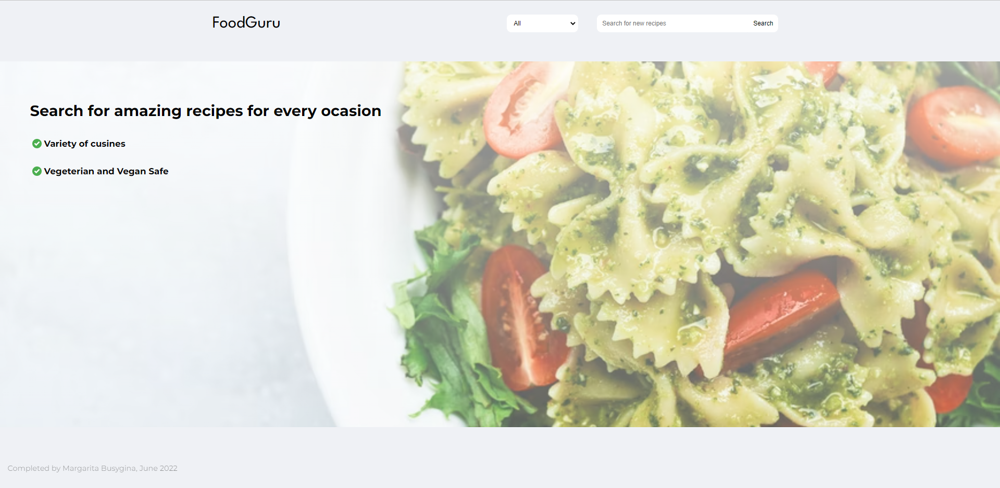
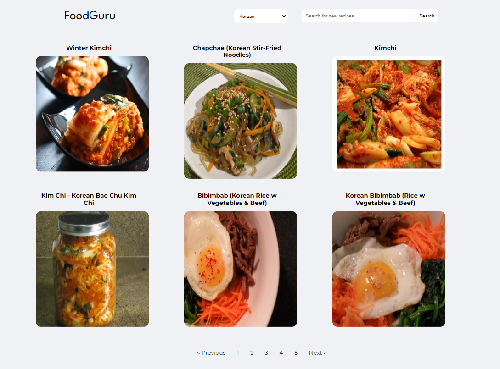
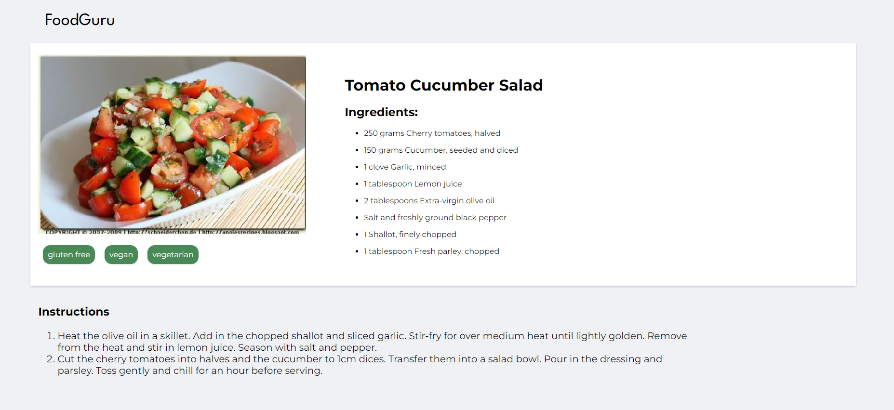

# Recipe search app called FoodGuru - built with React

## What I used to build this amazing project

* React
* spoonacular API (https://spoonacular.com/food-api/console#Dashboard)
* webpack
* CSS and HTML

## Search Recipies of Different Cuisines

## Read more abouut the recipe

## Live Version

Please follow this url to run my application: https://teal-lokum-a6872b.netlify.app/

##  Contact 👋
If you find any issues or you want to share your feedback, please email me at busygina.rita.ca@gmail.com

Thanks for checking out one of my projects

Completed by Margarita Busygina
Ottawa, Canada
June 2022
